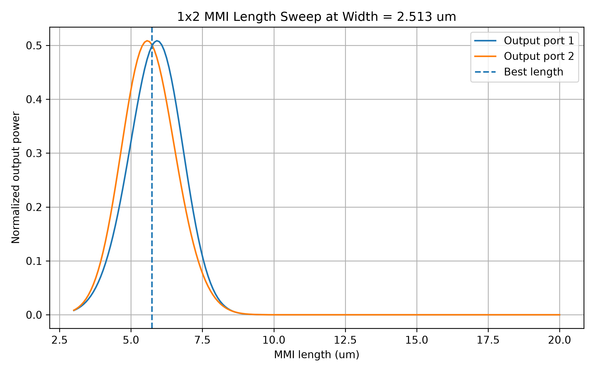
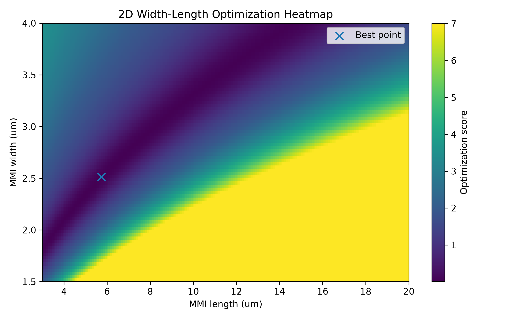
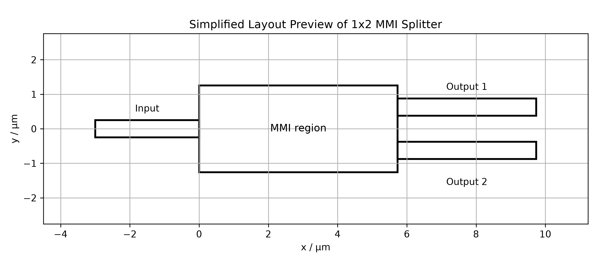

# 基于 AI 的 1×2 MMI 光功率分束器自动设计报告（V1）

## 一、Demo 版本说明

本报告对应 **AI 光子芯片设计平台 Demo V1：物理建模增强版**。

相比 V0 版本，V1 不再只使用固定的有效折射率和一维长度扫描，而是在原有自动化流程基础上进一步加入了：

1. SOI 平台材料参数库；
2. 简化有效折射率 neff 估算模块；
3. MMI 宽度与长度二维联合扫描；
4. 二维优化热力图；
5. 基于最优宽度和长度的 GDS 版图生成；
6. 中文设计报告和完整结果包输出。

当前 V1 版本的重点是验证“物理参数—器件建模—参数优化—版图生成”的自动化链路，并为后续接入真实电磁场求解器打基础。

---

## 二、设计目标

本次 demo 以 **1×2 MMI 光功率分束器** 为示例器件，目标是在 SOI 光子平台上实现接近 50:50 的光功率分束。

具体目标如下：

| 项目 | 内容 |
|---|---|
| 器件类型 | 1x2_mmi_splitter |
| 光子平台 | SOI |
| 工作波长 | 1.55 μm |
| 目标分光比 | 50:50 |
| 优化目标 | 两个输出端口功率接近 0.5，同时降低插入损耗和分光不均衡 |

---

## 三、SOI 平台材料参数

V1 版本加入了基础材料参数库。当前使用的 SOI 平台参数如下：

| 参数 | 数值 |
|---|---:|
| 核心材料 | Si |
| 包层材料 | SiO2 |
| 核心折射率 | 3.48 |
| 包层折射率 | 1.44 |
| 波导宽度 | 0.5 μm |
| 波导高度 | 0.22 μm |
| 工作波长 | 1.55 μm |

需要说明的是，当前折射率参数用于 demo 近似计算，后续可以替换为更精确的材料色散模型或具体 PDK 数据。

---

## 四、有效折射率估算

V1 版本新增了简化有效折射率估算模块。系统根据核心折射率、包层折射率、波导宽度、波导高度和工作波长估算有效折射率 neff。

本次计算结果如下：

| 指标 | 数值 |
|---|---:|
| 系统估算 neff | 2.8203 |
| 实际使用 neff | 2.8203 |
| 是否使用系统估算 neff | True |

当前 neff 估算模块仍属于简化模型，不是真实 FDE、FEM 或 MODE Solver 结果。后续可将该模块替换为 FEMWELL、MPB、Lumerical MODE 或 COMSOL Mode Analysis 等真实模式求解器。

---

## 五、MMI 初始物理建模

MMI 分束器的基本原理是 **多模干涉自成像效应**。

当输入光进入较宽的 MMI 区域后，会激发多个横向模式。不同模式在传播过程中积累不同相位，并在特定传播长度处重新组合形成自成像，从而实现光功率分束。

当前 V1 版本仍使用简化自成像模型估算 MMI 初始长度：

| 指标 | 数值 |
|---|---:|
| 名义 MMI 宽度 | 2.5 μm |
| 初始估算 MMI 长度 | 5.686 μm |

该初始长度只作为参数扫描参考，并不代表最终精确设计结果。

---

## 六、二维参数扫描与优化结果

V1 将 V0 中的一维长度扫描升级为 **MMI 宽度—长度二维联合扫描**。

扫描设置如下：

| 参数 | 数值 |
|---|---:|
| MMI 长度扫描范围 | 3.0–20.0 μm |
| 长度扫描点数 | 200 |
| MMI 宽度扫描范围 | 1.5–4.0 μm |
| 宽度扫描点数 | 80 |

系统综合考虑输出功率误差、插入损耗、分光不均衡和宽度偏离惩罚，选择当前模型下的最优结构参数。

优化结果如下：

| 指标 | 结果 |
|---|---:|
| 最佳 MMI 宽度 | 2.513 μm |
| 最佳 MMI 长度 | 5.734 μm |
| Output port 1 归一化功率 | 0.4990 |
| Output port 2 归一化功率 | 0.5010 |
| 插入损耗 | 0.000 dB |
| 分光不均衡 | -0.017 dB |
| 最优评分 | 0.003024 |

从当前结果看，两个输出端口功率接近 0.5，说明该设计在 V1 简化模型下实现了接近 50:50 的分光效果。

---

## 七、MMI 长度扫描图

下图展示了在最优 MMI 宽度下，不同 MMI 长度对应的两个输出端口归一化功率变化。

---

## 八、MMI 宽度—长度二维优化热力图

下图展示了不同 MMI 宽度和长度组合下的优化评分分布。颜色表示目标函数评分，评分越低，代表越接近当前优化目标。

该图用于直观展示系统如何在二维参数空间中寻找最优结构。

---

## 九、版图生成与版图预览

系统根据优化得到的最佳 MMI 宽度和最佳 MMI 长度，调用 gdsfactory 自动生成 1×2 MMI 分束器的 GDS 版图文件。

生成的 GDS 文件路径为：

`outputs\mmi1x2_demo.gds`

同时，系统生成了简化版图预览图：

需要注意的是，版图预览图是根据参数绘制的结构示意图，不是 GDS 文件的精确截图；真正的版图文件为 `mmi1x2_demo.gds`。

---

## 十、自动生成文件

本次 V1 设计流程自动生成以下文件：

| 文件 | 作用 |
|---|---|
| `outputs/design_spec.json` | 保存结构化设计参数 |
| `outputs/physical_params.json` | 保存材料参数和 neff 估算结果 |
| `outputs/optimization_result.json` | 保存二维优化结果 |
| `outputs/length_sweep.png` | 最优宽度下的 MMI 长度扫描图 |
| `outputs/width_length_heatmap.png` | MMI 宽度—长度二维优化热力图 |
| `outputs/layout_preview.png` | 1×2 MMI 简化版图预览 |
| `outputs/mmi1x2_demo.gds` | 自动生成的 GDS 版图文件 |
| `outputs/report.md` | 自动生成的中文设计报告 |
| `outputs/ai_pic_demo_results.zip` | 完整结果包 |

---

## 十一、当前 V1 demo 的局限性

当前版本虽然增强了物理参数链路，但仍属于轻量级 demo，主要局限如下：

1. **neff 估算仍是近似模型**  
   当前有效折射率由简化经验模型估算，不是真实模式求解结果。

2. **MMI 响应仍是替代模型**  
   输出功率、插入损耗和分光不均衡来自轻量级 surrogate model，并不代表真实器件性能。

3. **未计算真实电磁场分布**  
   当前没有求解 TE/TM 模式场、光场传播图或能量分布。

4. **未提取真实 S 参数**  
   当前结果不能直接作为最终设计验证结果使用。

5. **尚未加入 DRC / LVS / 工艺规则检查**  
   GDS 文件已经可以生成，但还没有进行完整的工艺规则验证。

---

## 十二、后续升级方向

后续可以从以下方向继续完善：

1. **接入真实 Mode Solver**  
   将 `core/mode_solver.py` 替换为 FEMWELL、MPB、Lumerical MODE 或 COMSOL Mode Analysis。

2. **接入真实电磁场求解器**  
   将 `core/mmi_model.py` 替换为 Meep、Tidy3D、FEMWELL、COMSOL 或 Ansys Lumerical 仿真结果。

3. **提取真实 S 参数**  
   计算 S11、S21、S31 等参数，用于评价插入损耗、反射和分光性能。

4. **加入 PDK 和 DRC 检查**  
   引入更真实的工艺层信息、最小线宽、最小间距和版图规则。

5. **扩展更多器件类型**  
   在 MMI 基础上继续加入 ring resonator、directional coupler、grating coupler、Y-branch 等器件。

6. **升级 AI 需求解析模块**  
   将当前规则版解析器替换为大模型结构化输出或 LangGraph workflow。

---

## 十三、阶段性结论

当前 V1 demo 已经在 V0 自动化闭环基础上进一步增强了物理建模链路。

系统不再只依赖手动输入 neff，而是加入了 SOI 材料参数库和简化有效折射率估算模块；同时，优化过程也从单一 MMI 长度扫描扩展为 MMI 宽度和长度的二维联合扫描。

因此，V1 版本已经更接近真实 PIC 设计流程中的“材料参数—物理建模—参数优化—版图生成”链路，可作为后续接入真实电磁场求解器和 AI 工作流的基础框架。
